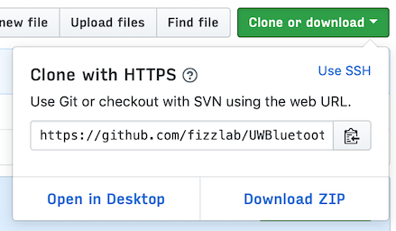

# UW HCDE Bluetooth Library
A simple drop-in abstraction library for the Adafruit Bluefruit Library, written
for the UW HCDE Program

## Installation
### Beginner
- Download the library as a ZIP file using the green button in the top right:

- In the Arduino IDE, use the `Sketch` dropdown and select `Include Library` and
`Add .ZIP Library...`.
- Select the ZIP file you just downloaded.

### Advanced
- Install `git` if you don't already have it.
- Clone the library into Arduino's library directory
 - It *should* be the `libraries` folder in the `Arduino` folder you save your
 sketches to.

## Notes
- This project is very much a work-in-progress and functionality may be limited.
- This library was made only for the ***Arduino Uno*** and its derivatives, and
may not work for other platforms.
